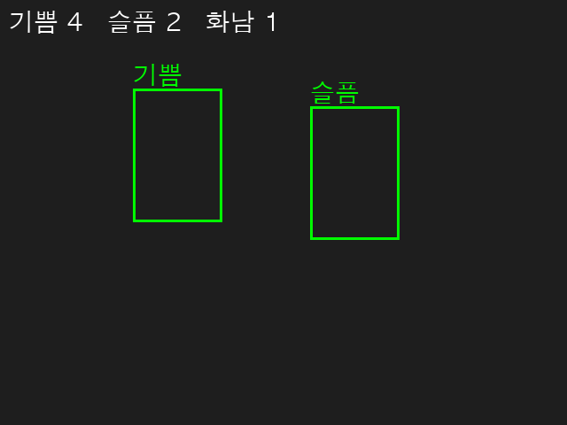
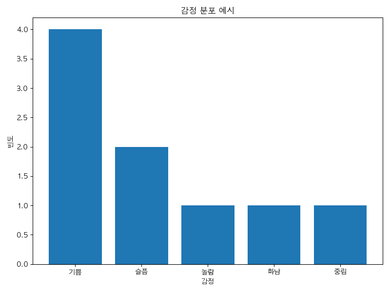
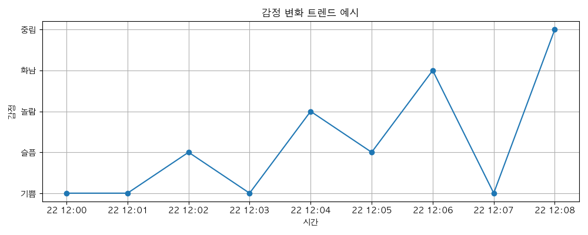

# emotion_recognition_project

**emotion_recognition_project**는 실시간 얼굴 인식 및 감정 분류, 감정 누적 통계 및 시각화를 통합한 올인원 감정 분석 시스템입니다.  
Python과 C++을 결합하여 고성능, 고가시성, 고확장성을 동시에 제공합니다.

---

## 🔍 주요 기능

- 🎥 실시간 얼굴 감정 추론 (MediaPipe + CNN)
- 📊 C++로 감정 통계 누적 처리 (pybind11 연동)
- 🎛 감정별 색상 출력 + 필터링 기능 + 키보드 제어
- 📈 바 차트 + 시간 흐름 트렌드 그래프 자동 생성
- 💾 감정 로그 CSV 자동 저장 + 분석용 준비 완료

---

## 🔧 개발 히스토리 요약

이 프로젝트는 다음 순서로 개발되었습니다:

1. CNN 모델을 학습하기 위한 `train.py`와 감정 예측용 `infer.py` 구현
2. 실시간 감정 인식을 위한 `face_detector.py` 구축
3. 감정 누적 및 통계를 담당하는 `emotion_utils.cpp` (C++) + `bindings.cpp` → `cpp_module` 빌드
4. Python과 C++을 연결하는 `cpp_bridge.py` 구성 (pybind11)
5. 감정 기록 기능 (`recorder.py`)과 로그 저장 시스템 구축
6. 감정 통계를 바 차트로 시각화 (`plot_emotion_bar_chart`)
7. 시간 흐름 트렌드 그래프 기능 추가 (`plot_emotion_trend`)
8. 감정 필터링 (`f` 키) 및 감정별 색상 시각화 기능 완성
9. 최종 진입점 `run.py` 생성 → 실행 일원화

---

## 🧰 프로젝트 구조

```bash
emotion_recognition_project/
├── cpp/                      # C++ 감정 누적 및 바인딩 모듈
│   ├── emotion_utils.cpp
│   ├── emotion_utils.hpp
│   ├── bindings.cpp
│   └── video_processor.cpp
│
├── model/                   # 감정 분류 딥러닝 모델
│   ├── train.py             # CNN 모델 학습
│   └── infer.py             # 감정 예측
│
├── python/                  # Python 주요 로직
│   ├── face_detector.py     # 실시간 감정 인식 메인
│   ├── cpp_bridge.py        # C++ 바인딩 모듈
│   ├── recorder.py          # 감정 로그 CSV 기록
│   ├── visualizer.py        # 감정 그래프 (바 차트 / 트렌드)
│   └── ...                  
│
├── logs/                    # 감정 로그 저장 (.csv)
├── assets/                  # 이미지 저장 (그래프 등)
├── run.py                   # ✅ 전체 실행 진입점
├── requirements.txt
└── README.md


## 🚀 실행 방법 (Step-by-Step)

### 🔧 1. 가상환경 및 패키지 설치

```bash
git clone https://github.com/your-name/emotion_recognition_project.git
cd emotion_recognition_project
python3 -m venv venv
source venv/bin/activate
pip install -r requirements.txt

## 📸 샘플 실행 결과 (Sample Outputs)

### ▶️ 실시간 감정 인식 UI 화면
- 얼굴이 감지되면 실시간으로 감정이 분석되어 얼굴 위에 한글로 표시됩니다.
- 좌측 상단에는 누적 감정 카운트가 표시됩니다.
- `ESC` 키: 프로그램 종료



---

### 📊 감정 분포 막대 그래프
- `s` 키를 누르면 C++ 모듈로부터 감정 통계를 받아 바 차트로 시각화됩니다.
- matplotlib를 통해 즉시 출력됩니다.



---

### 📈 감정 추이 그래프
- `logs/*.csv` 감정 로그 기반으로 시간 흐름에 따른 감정 변화를 표시합니다.
- 샘플 로그 파일로 생성된 결과입니다.
- (별도 실행 또는 기록 후 사용)



---

## ⌨️ 단축키 요약

| 키(Key) | 기능 설명 |
|--------|------------|
| `ESC`  | 프로그램 종료 |
| `s`    | C++ 감정 통계 요청 및 바 차트 시각화 |
| `r`    | C++ 감정 통계 초기화 |
| `f`    | 감정 필터링 모드 토글 (지정 감정만 표시) |
